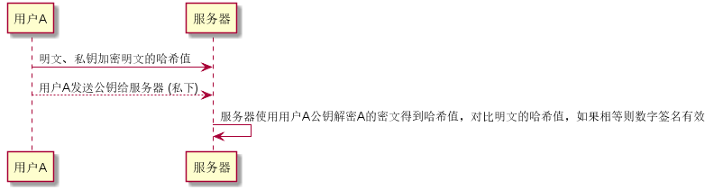
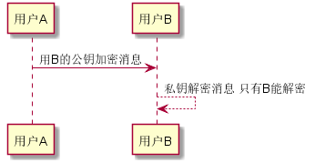
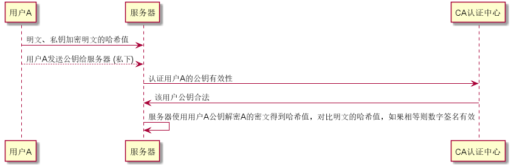

# 数字签名
+ 目的：不可抵赖性。
+ 过程：
  用户A-> 服务器: 明文、私钥加密明文的哈希值
  用户A--> 服务器: 用户A发送公钥给服务器 (私下)
  服务器-> 服务器: 服务器使用用户A公钥解密A的密文得到哈希值，对比明文的哈希值，如果相等则数字签名有效
  

# 非对称加密传输
+ 目的：消息不被截获
+ 过程：A-->B   A(私钥，公钥)   B(私钥，公钥)
  用户A -> 用户B: 用B的公钥加密消息
  用户B <--用户B: 私钥解密消息 只有B能解密

# 数字认证机构
+ 目的：解决数字签名中仿造公钥的问题
+ 过程：证书签证机关（CA）签发的对用户的公钥的认证
  用户A-> 服务器: 明文、私钥加密明文的哈希值
  用户A--> 服务器: 用户A发送公钥给服务器 (私下)
  服务器-> CA认证中心: 认证用户A的公钥有效性
  CA认证中心-> 服务器: 该用户公钥合法
  服务器-> 服务器: 服务器使用用户A公钥解密A的密文得到哈希值，对比明文的哈希值，如果相等则数字签名有效

# 对称加密和非对称加密
+ 非对称加密
 + 密钥对：
 + 应用：数字签名
+ 

